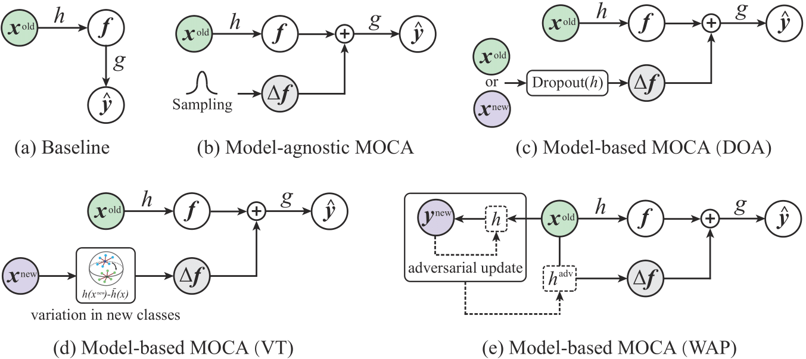

# ☕ (MOCA) Continual Learning by Modeling Intra-Class Variation
This is an official implementation of the TMLR 2023 paper "Continual Learning by Modeling Intra-Class Variation" (MOCA).  
## Environment
This work is based on the code of [DER](https://github.com/aimagelab/mammoth):
```bash
pip install -r requirements.txt
```
## Setup
+ Use `./utils/main.py` to run experiments.
+ Use argument `--load_best_args` to use the best hyperparameters from the paper.

## TODO:
- [x] Release code!
- [x] Bash Arguments!
- [ ] The code is still dirty and we'll sort it out soon.
- [ ] 2D Visualization code and Gradients Analysis code.

## Examples
For reproducing the results of our MOCA-Gaussian on Cifar-100, run:
```bash
python ./utils/main.py --load_best_args --model er --dataset seq-cifar100 --buffer_size 500  --para_scale 1.5 --gamma_loss 1 --norm_add norm_add --method2 gaussian --noise_type noise
```

For reproducing the results of our MOCA-WAP on Cifar-100, run:
```bash
python ./utils/main.py --load_best_args --model er --dataset seq-cifar100 --buffer_size 500  --para_scale 1.5 --gamma_loss 10  --norm_add norm_add --advloss none --target_type new_labels --noise_type adv --inner_iter 1
```

## Citation
If you find this code or idea useful, please cite our work:
```bib
@article{yu2022continual,
  title={Continual Learning by Modeling Intra-Class Variation},
  author={Yu, Longhui and Hu, Tianyang and Hong, Lanqing and Liu, Zhen and Weller, Adrian and Liu, Weiyang},
  journal={arXiv preprint arXiv:2210.05398},
  year={2022}
}
```

## Contact
If you have any questions, feel free to contact us through email (yulonghui@stu.pku.edu.cn). Enjoy!

## Intra-class Variation Gap
<p align="center">

</p>

## Representation Collapse
<p align="center">

</p>

## Gradient Collapse
<p align="center">

</p>

## MOCA Framework
<p align="center">

</p>

## MOCA Variants
<p align="center">

</p>
